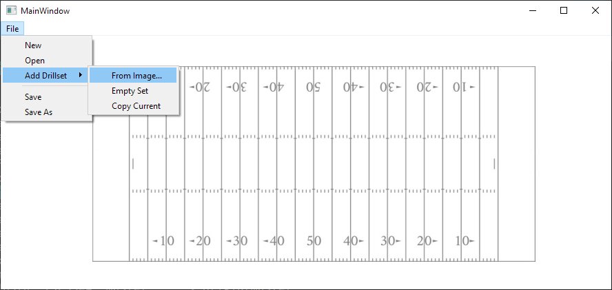
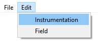

# User Guide

## Table of Contents
1. [About](#about)
2. [FAQ](#faq)
3. [Creating a New Show](#creating-a-new-show)
4. [Loading, Saving, and Viewing Shows](#loading-saving-and-viewing-shows)
5. [Other](#other)

## About
This document will walk you through the basics of using Drill-Creator.

## FAQ
1. What does Drill-Creator do?
    - Drill-Creator is a unique program for creating marching-band drill sets from static images.
2. What is needed to run Drill-Creator?
    - Drill-Creator was written in Python 3.9.7, but should work for Python 3.8 and up.
3. What is Drill?
    - Drill refers to the placement and movements of players during a marching band show, represented as a series of sets with placement relative to football field yard lines and hash marks.
4. What is a Dot?
    - A Dot is a specific placement of 1 player within a Set.    
5. What is a Set?
    - A set is a specific point of time in a show. Players may stop in a particular set or simply move through it. Transitions are used to move between sets.A
6. What is a Step?
    - 1 Step referes to a distance of 22.5". There are 8 Steps for every 5 yards.
7. What kind of transitions can the program auto generate?
    - Transitions are calculated as Floats Transitions, meaning every player moves in a straight line to their next Dot taking an evenly sized step for each count of the transition.

## Creating a New Show
1. Setting Band Instrumentation
    
    Before you create a show, you will need to let the program know the instrumentation of your band. Using the "File" menu at the top left of the window, select File, then New, then Band. Then, simply follow the on-screen prompts to select the number of each instrument you have in your ensemble, and select OK. You only need to do this step once
    per ensemble--the program will remember your instrumentation going forward.
    TODO SCREENSHOT
2. Creating An Empty Show
   
    Now that you have your instrumentation loaded in, you can create as many shows as you want with that band. To create a new show, navigate to the "File" menu, select New, then Show. The program will notify you that a new show has been created. The next thing to do is to add drillsets to your show.
    TODO SCREENSHOT
3. Creating New Drillsets From Images

    To add a new drillset using the image converter, go to "File", "Add Drillset", and click "From Image". A dialog will prompt you to select an image to convert into drill. After selecting an image, you will need to enter the number of counts the set should last. This is vital for our program to create a proper transition! After you have inputted this information, the program will add a new set from the selected image immediately following the set you have selected. So, to add a new set to the end of your show, make sure you are viewing the last set in your show.

4. Editing a Drillset
    
    With "Page" view enabled, click the "Edit" button to enable editing. You can then drag individual marchers around the field as desired. Click "Save Changes" when you are satisfied.
5. Sanity Checking Your Edits
    
    At any point in this process, you can press "Check Current Set" to analyze the current set for collisions or impossible steps. A dialog will pop up to inform you of such issues.
    
7. How to Duplicate a Drillset
    
    To duplicate a drillset (for holding, minor changes, etc.), simply navigate with the arrow buttons to the set you wish to duplicate, and go to "File", "Add Drillset", and "Copy Current". This will create a new set immediately following the current set. Additionally, you will need to let the program know how many counts the new inserted page should last.

## Loading, Saving, and Viewing Shows

1. Loading

    TODO
    Open a show by selecting a file with `.march` extension
    
    File > Open
    
2. Saving
    
    TODO
    Save a show with a `.march` extension

    File > Save As
    
    File > Save
    
3. Stepping Through Shows

    When you have loaded a show, the bottom of the window has buttons to allow you to navigate through your show. By default, "Page" should be lit up. This indicates that the arrow buttons will move forward or backwards an entire set when pressed. If you press the "Page" button, it will change to "Count." With "Count" lit up, the arrows will move through the show only one count at a time.
4. Page/Count View
    
    When you have a loaded show, the top of the window will show information about the drillset you are on, such as its page number and count. Additionally, the info button at the bottom of the window will display notes for that particular set that you can read and edit.

## Other

1. Editing Instrumentation For a Pre-existing Band
    TODO
    Edit the number of each instrument you have in your ensemble.
      
    Edit > Instrumentation
    
    

2. Editing Hash Locations on Field
    TODO
    To switch between NCAA (default), high school and NFL hash marks.
    
    Edit > Field

    

3. Re-ordering Existing Sets in a show
    TODO idk
